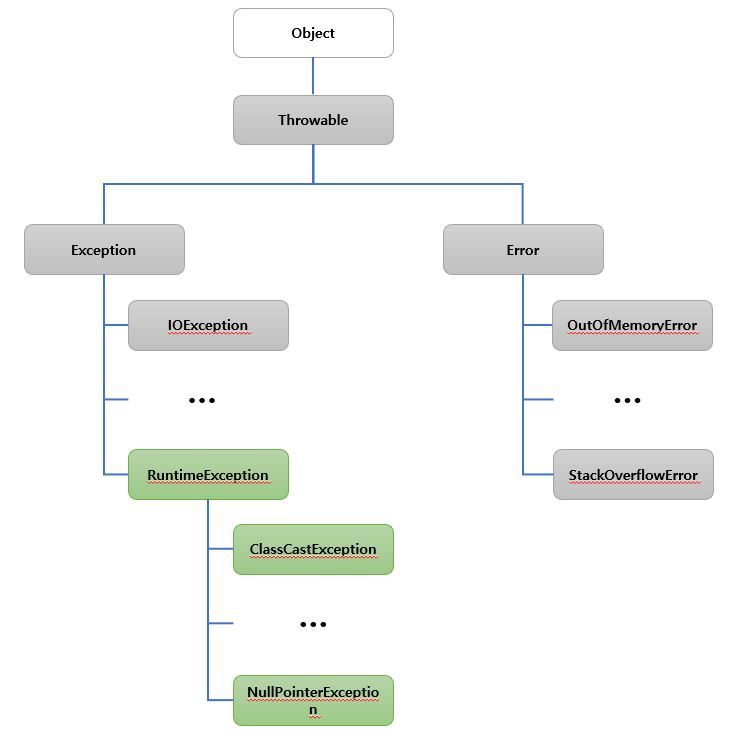

# Chapter 8. 예외처리
## 자바에서 예외 처리 방법(try, catch, throw, throws finally)
***
### 1. 기본적인 예외처리 구문을 이용하여 예외 처리
기본적인 `try`, `catch`, `finally` 키워드를 이용하여 다음과 같이 예외처리 할 수 있다.
```java
public class Test {
    public static void main(String[] args) {
        try {
            // 예외 처리할 구문 1
            // 예외 처리할 구문 2

        }catch (NullPointerException e) {
            System.out.println("NullPointerException 발생했습니다.");

        }catch (ClassCastException e) {
            System.out.println("ClassCastException이 발생했습니다.");

        }catch (Exception e) {
            System.out.println("알수 없는 에러가 발생했습니다.");

        }finally {
            System.out.println("여기는 항상 실행됩니다.");
        }
        System.out.println("굿바이 ~");
    }
}
```
1. `try 블록`의 `예외 처리할 구문 1`에서 `IOException`이 발생한 경우  
   `try 블록` → `IOException catch 블록` → `finally 블록` 순서로 처리된다.


2. `try 블록`의 `예외 처리할 구문 1`에서 `ClassCastException`이 발생한 경우  
   `try 블록` → `ClassCastException catch 블록` → `finally 블록` 순서로 처리된다.
   

3. `try 블록`의 `예외 처리할 구문 1`에서 예외처리 하지 않은 Exception 이 발생한 경우  
   `try 블록` → `Exception catch 블록` → `finally 블록` 순서로 처리된다.

* `예외 처리할 구문 1`에서 예외가 발생한 경우 `예외 처리할 구문 2`는 실행되지 않는다.
* `finally 블록`은 예외처리할 구문에서 예외발생 유무와 상관없이 마지막으로 항상 실행되는 구문을 작성한다.

### 2. throws 키워드를 이용한 예외 전달
`throws` 키워드를 해당 함수를 호출한 부분으로 예외를 전달하여 호출한 쪽에서 예외처리 할 수 있다.
```java
public class Test2 {
    public static void main(String[] args) {
        try{
            printHello(null);

        }catch (NullPointerException e){
            System.out.println("please input id");

        }finally {
            System.out.println("Good Bye ~~");
        }
    }

    public static void printHello(String id) throws NullPointerException {
        if(id.equals("A")){
            System.out.println("Hello A !!!");
        }else {
            System.out.println("Who are you?");
        }
    }
}
```
* 실제 Exception은 printHello 메소드에서 발생했으나 printHello를 호출하는 쪽에서 예외처리 하도록 throws 키워드를 이용하여 예외를 전달 하였다


### 3. throw 키워드를 이용한 예외 발생
`throw` 키워드를 이용하여 임의로 Exception을 발생시킬 수 있다.
```java
public class Test3 {
    public static void main(String[] args) {
        try{
            printHello("");

        }catch (NullPointerException e){
            System.out.println("please input id");

        }finally {
            System.out.println("Good Bye ~~");
        }
    }

    public static void printHello(String id) throws NullPointerException {
        if(id == null || id.equals("")){
            throw new NullPointerException();
        }else {
            System.out.println("Hello " + id);
        }
    }
}
```
* id 가 null 이거나 공백일경우 throw 키워드를 이용하여 NullPointerException 을 임의로 발생시켰다.

## 자바가 제공하는 예외 계층 구조
***
Exception 과 Error 모두 Throwable 클래스를 상속받고 있으며, Excpetion은 크게 RuntimeException 과 그외 Exception으로 구분된다.




## Exception과 Error의 차이는?
***
`Exception`은 프로그램 코드에 의해서 수습될 수 있는 오류를 말하며 (핸들링 가능)  
`Error`는 프로그램 코드에 의해서 수습될 수  없는 오류를 말한다 (핸들링 불가). 

`Exception`의 대표적인 예로는 `NullPointerException`, `ClassCastException` 등으로 코드 작성시 예외가 예상되어 해당 예외에 대해 오류가 발생했을 때 어떻게 처리할 것인지를 작성하여 오류를 핸들링 가능하다.

`Error`의 대표적인 예로는 `OutOfMemoryError`로 발생했을 시 코드로 핸들링 불가하며, 메모리를 늘리던지, 잘못된 코드(메모리 누수 등)을 찾아 수정해야 한다.

## RuntimeException과 RE가 아닌 것의 차이는?
***
`RuntimeException`과 `RE가 아닌`것의 차이는 컴파일 시 체크가 가능한지에 대한 여부이다.  
`RuntimeException`를 상속한 Exception 클래스들은 예외처리를 하지 않아도 컴파일시 에러가 발생하지 않지만, `RE가 아닌` Exception 클래스들은 예외처리를 해주지 않으면 컴파일시 에러가 발생 한다.

`RuntimeException`의 경우는 코드 작성시 예외가 발생하지 않도록 다음과 같이 코드를 수정하여 작성할 수도 있다.
```java
public class Test4 {
    public static void main(String[] args) {
        printHello(null);
    }

    public static void printHello(String id){
        /* OLD
        if(id.equals("A")){
            System.out.println("Hello A !!!");
        }else {
            System.out.println("Who are you?");
        }
        */
        
        // NEW
        if("A".equals(id)){
            System.out.println("Hello A !!!");
        }else {
            System.out.println("Who are you?");
        }
    }
}
```

## 커스텀한 예외 만드는 방법
***
`Exception` 클래스를 상속받아 다음과 같이 기본적인 커스텀 예외를 만들 수 있다.
```java
public class Test5 {
    public static void main(String[] args) {
        try {
            printHello(null);
        } catch (NotAException e) {
            System.out.println("Who are you?");
        }
    }

    public static void printHello(String id) throws NotAException {
        if("A".equals(id)){
            System.out.println("Hello A !!!");
        }else {
            throw new NotAException("Not A Exception");
        }
    }
}

class NotAException extends Exception {
    public NotAException(String message){
        super(message);
    }
}
```

